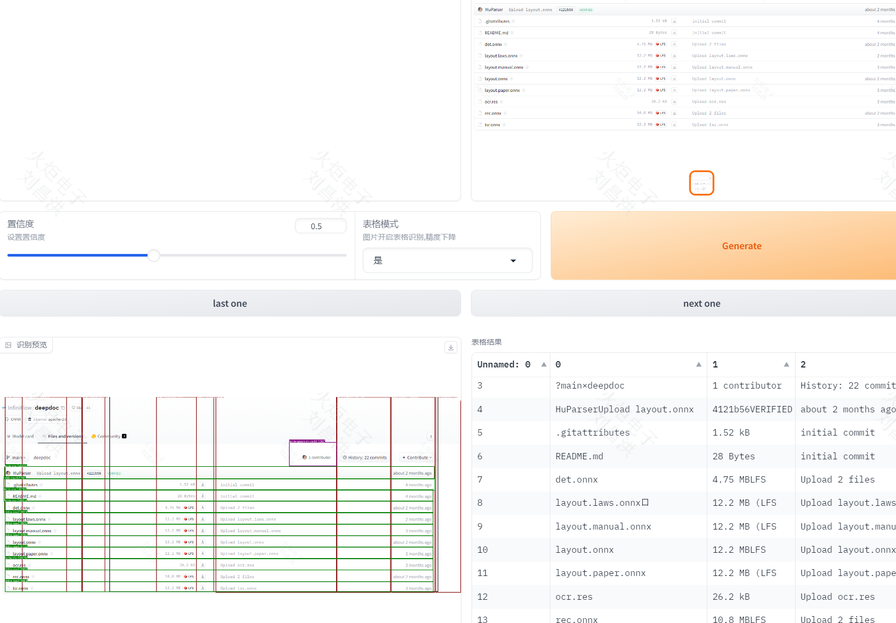
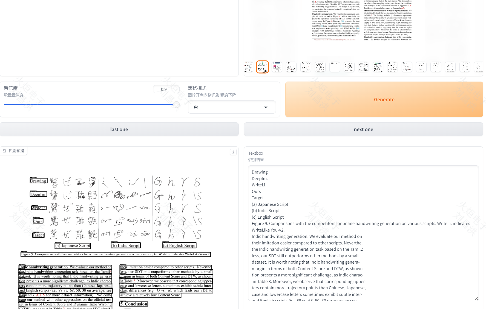

### Feature

- UI界面
- 程序整理
- 模型放置
- 依赖处理
- 表格生成

### Start

```shell
# vi utils.py ==>修改 PROJECT_BASE
python ui_deepdoc.py
or
nohup python ui_deepdoc.py > deepdoc.log &
```

- 表格样式识别UI



- 文档样式识别UI



### Install

```shell
cd deepdoc
conda create -n myDeepdoc python=3.11
conda activate myDeepdoc
# 删除里面有win的3个包
pip install -r requirements.txt
pip freeze > requirements.txt
# 修改utils.py   vi utils.py  /mnt/data/llch/myDeepdoc
PROJECT_BASE = r"D:\aProject\py\myDeepdoc"
# 可能有一些报错:please enable stickiness to ensure that all requests from the same user are routed to the same instance.
export no_proxy="localhost,127.0.0.1"
# Please use the NLTK Downloader to obtain the resource
import nltk
nltk.download("all")
```

### DeepDoc

- https://github.com/infiniflow/ragflow (from)

- [DeepDoc](#deepdoc)
    - [1. 介绍](#1-介绍)
    - [2. 视觉处理](#2-视觉处理)

<a name="1"></a>

#### 1. 介绍

对于来自不同领域、具有不同格式和不同检索要求的大量文档，准确的分析成为一项极具挑战性的任务。*Deep*Doc 就是为了这个目的而诞生的。到目前为止，
*Deep*Doc 中有两个组成部分：视觉处理和解析器。如果您对我们的OCR、布局识别和TSR结果感兴趣，您可以运行下面的测试程序。

```bash
python vision/t_ocr.py -h
usage: t_ocr.py [-h] --inputs INPUTS [--output_dir OUTPUT_DIR]
eg : python vision/t_ocr.py --inputs D:\wechatWork\WXWork\1688857567577400\Cache\File\2024-06\1111.jpg
     python vision/t_ocr.py --inputs .\input\sdt.pdf
options:
  -h, --help            show this help message and exit
  --inputs INPUTS       Directory where to store images or PDFs, or a file path to a single image or PDF
  --output_dir OUTPUT_DIR
                        Directory where to store the output images. Default: './ocr_outputs'
```

```bash
python vision/t_recognizer.py -h
usage: t_recognizer.py [-h] --inputs INPUTS [--output_dir OUTPUT_DIR] [--threshold THRESHOLD] [--mode {layout,tsr}]
eg: python vision/t_recognizer.py --inputs D:\wechatWork\WXWork\1688857567577400\Cache\File\2024-06\1111.jpg --threshold=0.2 --mode=tsr
    python vision/t_recognizer.py --inputs .\input\img.png --threshold=0.2 --mode=tsr
options:
  -h, --help            show this help message and exit
  --inputs INPUTS       Directory where to store images or PDFs, or a file path to a single image or PDF
  --output_dir OUTPUT_DIR
                        Directory where to store the output images. Default: './layouts_outputs'
  --threshold THRESHOLD
                        A threshold to filter out detections. Default: 0.5
  --mode {layout,tsr}   Task mode: layout recognition or table structure recognition
```

<a name="2"></a>

#### 2. 视觉处理

作为人类，我们使用视觉信息来解决问题。

- **OCR（Optical Character Recognition，光学字符识别）**。由于许多文档都是以图像形式呈现的，或者至少能够转换为图像，因此OCR是文本提取的一个非常重要、基本，甚至通用的解决方案。

```bash
python vision/t_ocr.py --inputs=path_to_images_or_pdfs --output_dir=path_to_store_result
```

输入可以是图像或PDF的目录，或者单个图像、PDF文件。您可以查看文件夹 `path_to_store_result` ，其中有演示结果位置的图像，以及包含OCR文本的txt文件。

  <div align="center" style="margin-top:20px;margin-bottom:20px;">
  
  </div>

- 布局识别（Layout
  recognition）。来自不同领域的文件可能有不同的布局，如报纸、杂志、书籍和简历在布局方面是不同的。只有当机器有准确的布局分析时，它才能决定这些文本部分是连续的还是不连续的，或者这个部分需要表结构识别（Table
  Structure Recognition，TSR）来处理，或者这个部件是一个图形并用这个标题来描述。我们有10个基本布局组件，涵盖了大多数情况：
    - 文本
    - 标题
    - 配图
    - 配图标题
    - 表格
    - 表格标题
    - 页头
    - 页尾
    - 参考引用
    - 公式

  请尝试以下命令以查看布局检测结果。

```bash
python vision/t_recognizer.py --inputs=path_to_images_or_pdfs --threshold=0.2 --mode=layout --output_dir=path_to_store_result
```

  输入可以是图像或PDF的目录，或者单个图像、PDF文件。您可以查看文件夹 `path_to_store_result` ，其中有显示检测结果的图像，如下所示：
  <div align="center" style="margin-top:20px;margin-bottom:20px;">
  
  </div>

- **TSR（Table Structure Recognition，表结构识别）**
  。数据表是一种常用的结构，用于表示包括数字或文本在内的数据。表的结构可能非常复杂，比如层次结构标题、跨单元格和投影行标题。除了TSR，我们还将内容重新组合成LLM可以很好理解的句子。TSR任务有五个标签：
    - 列
    - 行
    - 列标题
    - 行标题
    - 合并单元格

  请尝试以下命令以查看布局检测结果。

```bash
python vision/t_recognizer.py --inputs=path_to_images_or_pdfs --threshold=0.2 --mode=tsr --output_dir=path_to_store_result
```

  输入可以是图像或PDF的目录，或者单个图像、PDF文件。您可以查看文件夹 `path_to_store_result` ，其中包含图像和html页面，这些页面展示了以下检测结果：

  <div align="center" style="margin-top:20px;margin-bottom:20px;">
  
  </div>

<a name="3"></a>
